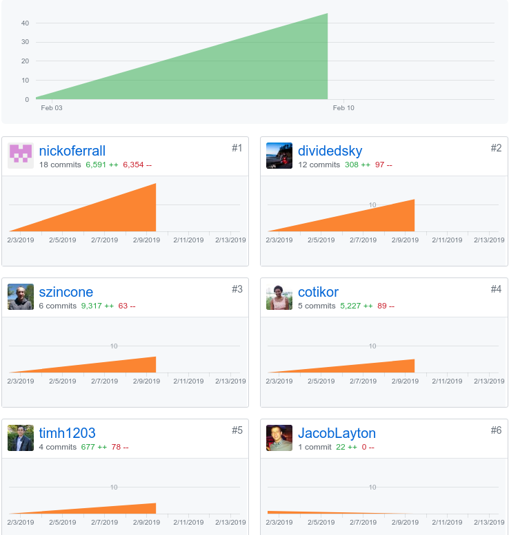

## Summary
This was our first week in Lambda Labs, Lambda's five-week program where students work together on a team to create a real-world application. Our team got off to a good start, and it's exciting wrapping up the first week and looking ahead to what we hope to accomplish in the next four weeks.

The first two days of the week were spent mostly planning. There was very little code written at all, which was quite a change from the last 15 weeks at Lambda School. Spending so much time planning and so little time coding was a bit challenging, but also a rewarding experience. I have a tendency to jump straight into code before I really think the big picture through, so it was a valuable experience to plan out all the technologies we will be using and a plan of attack on how to approach the project.

## Tasks Pulled
### Front End
Although I mostly worked on the back end this week, on Wednesday the whole group worked together as a team to get the project up and running, both on the front end and the back.

Because we started the project in a separate organization and then merged all the changes, there were no pull requests for the front end, but here are a few of the Trello tasks I participated in:

* https://trello.com/c/G8lLgBEL/27-install-dependencies-material-ui-create-react-app-react-router-dom-axios-react-testing-library-prettier-eslint-dotenv-papaparse

* https://trello.com/c/WQj1VhsM/15-get-endpoint-sanity-check-set-up

### Back End
I mostly ended up working on the back end this week, mostly on setting up the database.

* setting up postgres
  * [trello](https://trello.com/c/h9ZfABmL/22-set-up-postgres)

* migrations/schema
  * [trello](https://trello.com/c/Nfxd1GNd/23-set-up-migrations-and-tables)
  * [git](https://github.com/Lambda-School-Labs/labs10-student-follow/pull/3)

* getting heroku to play nice with postgres
  * [trello](https://trello.com/c/geA2e9xN/45-connect-postgres-db-to-codebase)
  * [git](https://github.com/Lambda-School-Labs/labs10-student-follow/pull/15)

* using faker to seed db
  * [trello](https://trello.com/c/lqKFh0lR/24-use-faker-to-create-teachers)
  * [git](https://github.com/Lambda-School-Labs/labs10-student-follow/pull/11)
