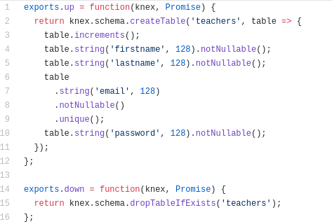

*My github handle: dividedsky*

# Part One - Individual Accomplishments
## Summary
This was our first week in Lambda Labs, Lambda's five-week program where students work together on a team to create a real-world application. Our team got off to a good start, and it's exciting wrapping up the first week and looking ahead to what we hope to accomplish in the next four weeks.

The first two days of the week were spent mostly planning. There was very little code written at all, which was quite a change from the last 15 weeks at Lambda School. Spending so much time planning and so little time coding was a bit challenging, but also a rewarding experience. I have a tendency to jump straight into code before I really think the big picture through, so it was a valuable experience to plan out all the technologies we will be using and a plan of attack on how to approach the project.

## Tasks Pulled
### Front End
Although I mostly worked on the back end this week, on Wednesday the whole group worked together as a team to get the project up and running, both on the front end and the back.

Because we started the project in a separate organization and then merged all the changes, there were no pull requests for the front end, but here are a few of the Trello tasks I participated in:

* Client setup
  * [trello](https://trello.com/c/G8lLgBEL/27-install-dependencies-material-ui-create-react-app-react-router-dom-axios-react-testing-library-prettier-eslint-dotenv-papaparse)

* First endpoint
  * [trello](https://trello.com/c/WQj1VhsM/15-get-endpoint-sanity-check-set-up)

### Back End
I mostly ended up working on the back end this week, mostly on setting up the database.

* setting up postgres
  * [trello](https://trello.com/c/h9ZfABmL/22-set-up-postgres)

* migrations/schema
  * [trello](https://trello.com/c/Nfxd1GNd/23-set-up-migrations-and-tables)
  * [git](https://github.com/Lambda-School-Labs/labs10-student-follow/pull/3)

* getting heroku to play nice with postgres
  * [trello](https://trello.com/c/geA2e9xN/45-connect-postgres-db-to-codebase)
  * [git](https://github.com/Lambda-School-Labs/labs10-student-follow/pull/15)

* using faker to seed db
  * [trello](https://trello.com/c/lqKFh0lR/24-use-faker-to-create-teachers)
  * [git](https://github.com/Lambda-School-Labs/labs10-student-follow/pull/11)

## Detailed Analysis

As mentioned, I mostly worked on setting up the database this week. After coming up with the user model, I made the migrations for the tables, two of which are shown below.

_teachers table_

_students-classes table_

One problem we stumbled against was dealing with how to truncate tables when the databse was reseeded. In SQLite, this is as simple as adding `knex.truncate()` to the beginning of the seeding function, but in Postgres this will throw a foreign constraint error on any tables with foreign keys. After some research, I came up with a messy solution and wrote a script to seed the files:

However, Chaya came up with the much cleaner solution of adding the truncate statement to the seeds, so I adopted that strategy:

# Part Two - Milestone Reflections
During the beginning of the week when we were analyzing the project specifications and analyzing the TDD, I quite a bit of time researching what database we should use and how to design the schema. We discussed whether to use a relational database such as Postgres or MySQL or a nonrelational database such as MongoDB.

In the end, we decided to go with a relational database and settled on Postgres. Postgres provides functionality similar to SQLite3, which we all have had some experience with at Lambda, but is more robust and more of a production-grade database. It also integrates much better with Heroku, which is where we are deploying our back end.

After discussing the schema, I drafted this mock for the basic outline of our table.

This schema provides most of the functionality we needed to begin our project, although we have made several changes to it and will most likely need to make a few more as the project grows.

Our back end has been deployed on [heroku](https://refreshr.herokuapp.com/teachers). It currently displays 500 teachers created with faker.

Our front end has been depolyed to [netlify](https://refreshr-app.netlify.com/). It is pulling the data from the backend and displaying the first name of all teachers in the database.
