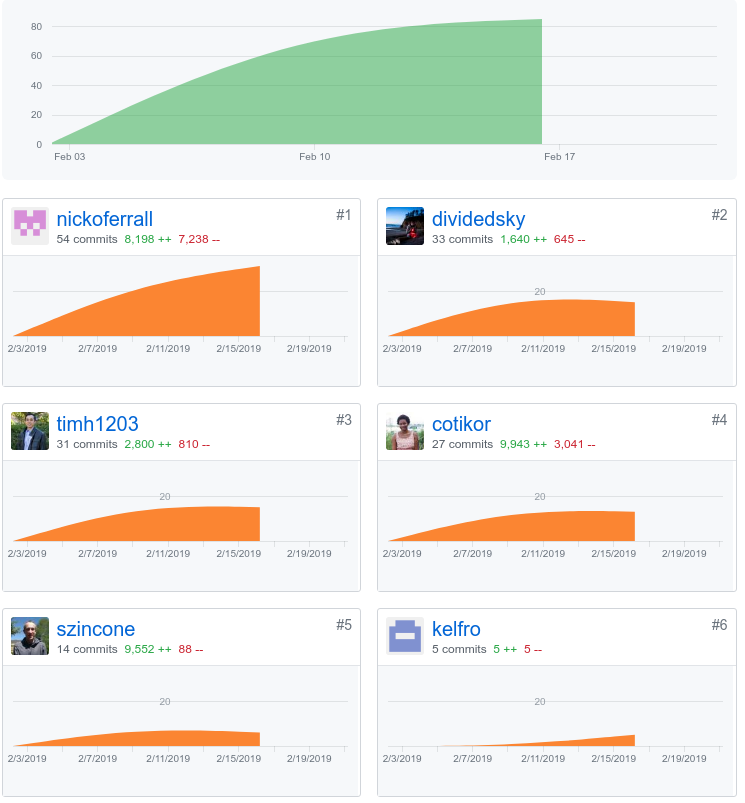
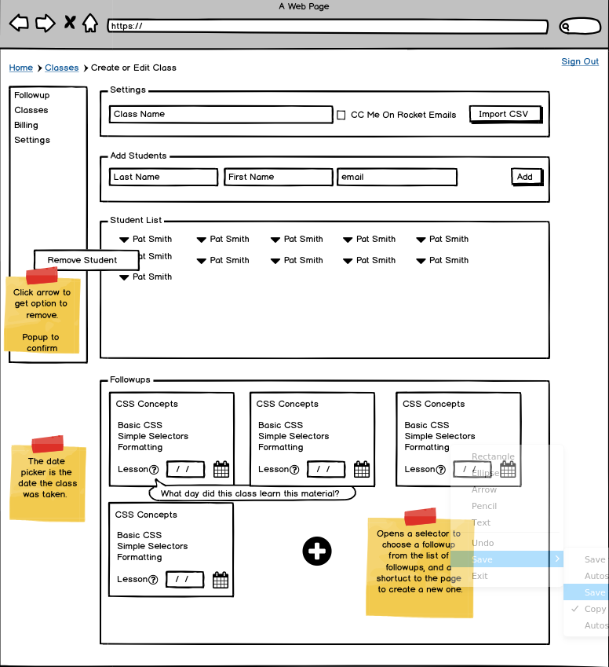
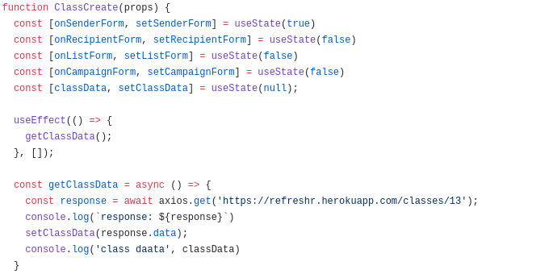
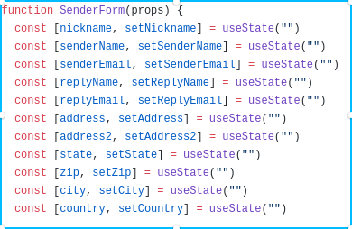
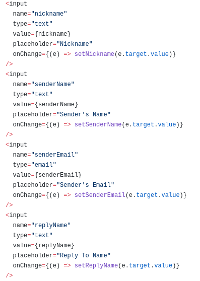
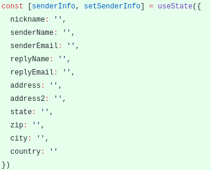
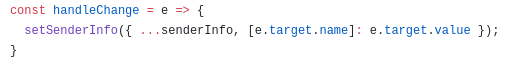

*My github handle: dividesky*

# Part One: Individual Accomplishments
## Summary
In our second week in Lambda Labs, the team focused on getting the API's running, finalizing our database models, and the connection between the front and back end, and implementing Auth0 for authentication.

Auth0 was probably the biggest challenge of the week, and I spent a lot of time working on that early in the week. On Monday and Tuesday, Sawyer, Chaya, and I walked through the examples on the Auth0 site and got the basic login functionality working. I also wrote some tests for some of the endpoints on the backend.

On Wednesday and Thursday, I split time between working on Auth0 and helping Tim to create the class create/edit form in a way that made sense with our SendGrid implementation. I also spent a bit of time writing some basic documentation for our API's endpoints.

## Tasks Pulled
### Front End
* Billing Page
  * [github]('https://github.com/Lambda-School-Labs/labs10-student-follow/pull/35')
  * [trell]('https://trello.com/c/Uc024Up1/57-stripe')

* Class page layout
  * [github]('https://github.com/Lambda-School-Labs/labs10-student-follow/pull/51')
  * [trello]('https://trello.com/c/LLn4GskP/63-connect-client-to-db-for-sendgrid')

* Class page forms
  * [github]('https://github.com/Lambda-School-Labs/labs10-student-follow/pull/61')

### Back End
* Readme
  * [github]('https://github.com/Lambda-School-Labs/labs10-student-follow/pull/41')
  * [trello]('https://trello.com/c/A8knr4m4/62-basic-backend-readme')

* Endpoint tests
  * [github]('https://github.com/Lambda-School-Labs/labs10-student-follow/pull/43')
  * [trello]('https://trello.com/c/gUl4WQ7b/44-tests-for-all-endpoints')

* Modify tables
  * [github]('https://github.com/Lambda-School-Labs/labs10-student-follow/pull/63')
  * [trello]('https://trello.com/c/fC6JW7UY/77-modify-tables')

## Detailed Analysis
Over the last couple of days, I spent some time working with Tim on the create/edit class page layout. We're aiming for a page that looks like this one from the Balsamiq.

The page is more complicated than it first appeared to me, and there's a lot of different things going on, so we've decided to break it into separate components. 

The top-level component for this page is ClassCreate. It will make an axios call to the api to get all of the needed details about the class, then pass that information down to its children components.

It will then use state to keep track of which part of the form the user is on and render only that part. The balsamiq shows all parts of the form in one page, but we thought it might be a better user experience if it was chunked into separate sections.

One thing that's been interesting in the change from class components to using hooks in react is how to make a dynamic handleChange function. Originally, the component we had yesterday implemented a different useState hook for every input.

Then each input had to use a separate onChange function.

We wanted to find a way to do this more like the old dynamic handleChange we used in classes, where we could simply have one function that called `this.setState({ [e.target.name]: e.target.value })`.

This is what we came up with. I would be glad to hear if there's a better/preferred way to do it, though. We have all the input values in one state object:

Then each input can use the same handleChange function, which spreads out the previous state and updates the input field passed to it.

This was kind of fun to figure out how to implement this in hooks instead of in classes. Again, if there's a better way to do it, I would love to know about it.

# Part Two: Milestone Reflections

