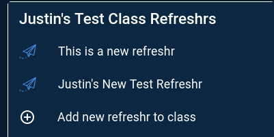
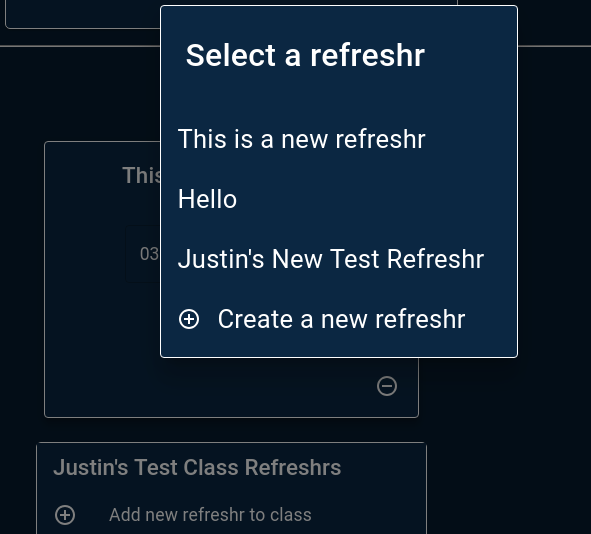
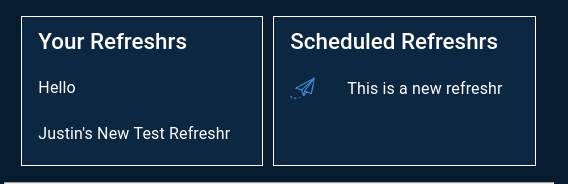

*My github handle: dividedsky*

# Part One: Individual Accomplishments
## Summary

Coming into our fifth and final week of labs, most of our core functionality was in place, so we were focused on polishing up the app and squashing any remaining bugs and errors in the console. One of the big things we realized was that the 90-90 rule is a real and challenging thing.

Fleshing out those last unpolished parts of the app is tedious and time-consuming. Little errors and flaws in the UI don't seem like they'll be that challenging when you're working on the core functionality. But when it's time to clean everything up, you realize there's still a lot to be done.

I mostly worked on the front end this week, and most of that work was focused on the edit class page. The edit class page was a complex one with a lot of different functionality and therefore a lot of room for bugs and errors to pop up.

## Tasks Pulled
### Front End
* Splitting the Edit Page to make it more manageable
  * [github]('https://github.com/Lambda-School-Labs/labs10-student-follow/pull/126')
  * [trello]('https://trello.com/c/mAg63AYY/93-edit-class-styling-and-logic')
* Rounding out the class edit functionality
  * [github]('https://github.com/Lambda-School-Labs/labs10-student-follow/pull/140')
  * [trello]('https://trello.com/c/mAg63AYY/93-edit-class-styling-and-logic')
* Campaign Form Styling
  * [github]('https://github.com/Lambda-School-Labs/labs10-student-follow/pull/155')
  * [trello]('https://trello.com/c/UGGkOeEV/136-campaign-form-lists')
* Fixing the class edit page
  * [github]('https://github.com/Lambda-School-Labs/labs10-student-follow/pull/166')
  * [trello]('https://trello.com/c/mAg63AYY/93-edit-class-styling-and-logic')

### Back End
* Adding endpoints for updating campaign dates
  * [github]('https://github.com/Lambda-School-Labs/labs10-student-follow/pull/166/files')
  * [trello]('https://trello.com/c/mAg63AYY/93-edit-class-styling-and-logic')

## Detailed Analysis
The edit class page is where I was focused most of the week. The edit class page has a ton of functionality in it and was a complex page to work in. We needed to be sure that the teacher would be able to edit the class name, add students, remove students, add and remove refreshrs, and update refreshr dates. Adding to the complexity of all this was that every single operation had to be run through SendGrid as well as our own database.

Initially, we had the class refreshrs displayed in cards at the bottom of the page. When we originally designed the page this looked fine, but as we continued to test it we realized that the section became very unwieldy when a lot of refreshrs were added to a class.

I changed the card style to use a Material UI list item, which I think looks much cleaner.

I also added a Material UI dialog for a teacher to select new refreshrs to add to the class.

The lists came out so much cleaner than the cards that I also replaced the cards on the create class form with two lists, one for the teachers refreshrs and ones for already scheduled refreshrs.

## Part Two: Milestone Reflections

The 90-90 rule is a quip, but there's a lot of truth to it, as well. Finishing up a project is not easy. All those things that you've been putting on the back burner for so long finally have to be deal with. There's a lot of bugs and UI issues that pop up that have to be remedied. And it's probably not uncommon to feel that if you just had a couple more days or weeks, you could get the app to be just the way you want it.

But looking back on what we accomplished, I feel really proud of what we did. It was definitely a challening experience, but also a really rewarding one. I feel really fortunate to have been part of such a great team and to have accomplished what we did. And I'm definitely looking forward to sleeping for the weekend now and not thinking about refreshrs, at least for a little while.
