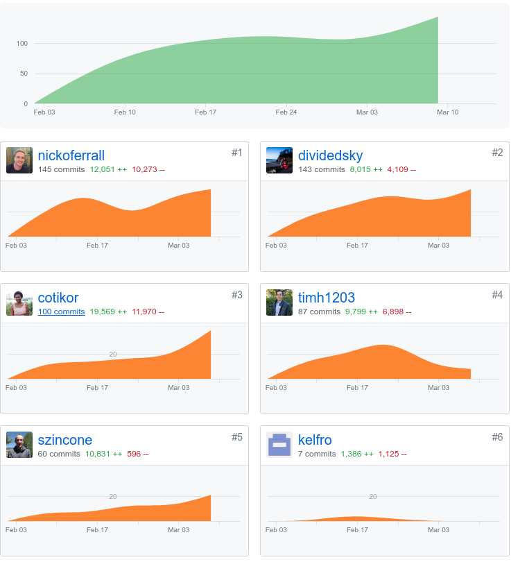

*My github handle: dividedsky*

# Part One: Individual Accomplishments
## Summary

Coming into our fifth and final week of labs, most of our core functionality was in place, so we were focused on polishing up the app and squashing any remaining bugs and errors in the console. One of the big things we realized was that the 90-90 rule is a real and challenging thing.

Fleshing out those last unpolished parts of the app is tedious and time-consuming. Little errors and flaws in the UI don't seem like they'll be that challenging when you're working on the core functionality. But when it's time to clean everything up, you realize there's still a lot to be done.

I mostly worked on the front end this week, and most of that work was focused on the edit class page. The edit class page was a complex one with a lot of different functionality and therefore a lot of room for bugs and errors to pop up.

## Tasks Pulled
### Front End
* Splitting the Edit Page to make it more manageable
  * [github]('https://github.com/Lambda-School-Labs/labs10-student-follow/pull/126')
  * [trello]('https://trello.com/c/mAg63AYY/93-edit-class-styling-and-logic')
* Rounding out the class edit functionality
  * [github]('https://github.com/Lambda-School-Labs/labs10-student-follow/pull/140')
  * [trello]('https://trello.com/c/mAg63AYY/93-edit-class-styling-and-logic')
* Campaign Form Styling
  * [github]('https://github.com/Lambda-School-Labs/labs10-student-follow/pull/155')
  * [trello]('https://trello.com/c/UGGkOeEV/136-campaign-form-lists')
* Fixing the class edit page
  * [github]('https://github.com/Lambda-School-Labs/labs10-student-follow/pull/166')
  * [trello]('https://trello.com/c/mAg63AYY/93-edit-class-styling-and-logic')

### Back End
* Adding endpoints for updating campaign dates
  * [github]('https://github.com/Lambda-School-Labs/labs10-student-follow/pull/166/files')
  * [trello]('https://trello.com/c/mAg63AYY/93-edit-class-styling-and-logic')

## Detailed Analysis
