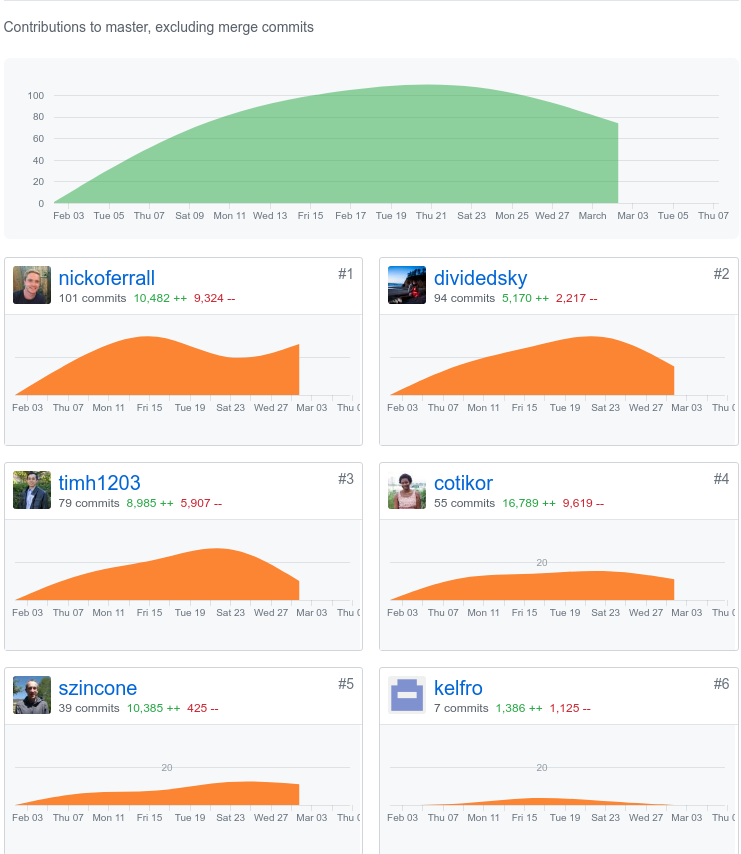
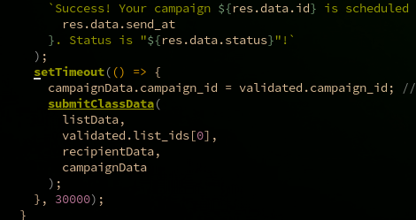
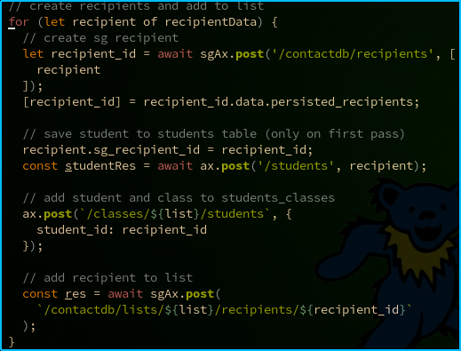
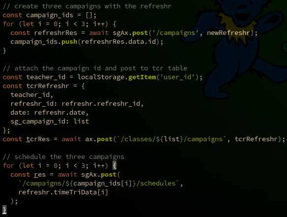

*My github handle: dividedsky*

# Part One: Individual Accomplishments
## Summary

For our fourth week in labs, we began to shift focus away from the core functionality of the site and towards the UI/UX and design of the site. Of course, as we continued to refine the look and feel of the site, we also still worked on the functionality, and we found that we still had quite a few tweaks to make to the back end to make sure the front end was receiving the correct data in the correct shape.

Although I did some work on the UI/UX, I have to give most of the credit to my teammates for really giving the site the look and feel that it developed over the week. I found myself spending more time on fixing or adding functionalities to the site--mostly ensuring that new class data was being saved to the database after coming back from SendGrid and working on the edit class functionality.

## Tasks Pulled
### Front End
* Edit Form Initial Design
  * [github]('https://github.com/Lambda-School-Labs/labs10-student-follow/pull/98')
  * [trello]('https://trello.com/c/mAg63AYY/93-edit-class-styling-and-logic')
* Fixing Axios calls on pages
  * [github]('https://github.com/Lambda-School-Labs/labs10-student-follow/pull/108')
  * [trello]('https://trello.com/c/Vkmo9pYA/120-update-axios-calls')
* More Edit Page Functionalities
  * [github]('https://github.com/Lambda-School-Labs/labs10-student-follow/pull/115')
  * [trello]('https://trello.com/c/mAg63AYY/93-edit-class-styling-and-logic')

### Back End
* Sending create class data to back end
  * [github]('https://github.com/Lambda-School-Labs/labs10-student-follow/pull/107')
  * [trello]('https://trello.com/c/f5Fem0Aq/87-adding-db-into-sendgrid-flow')
* Restructuring SG/DB flow from class create 
  * [github]('https://github.com/Lambda-School-Labs/labs10-student-follow/pull/123')
  * [trello]('https://trello.com/c/PbyyANUM/116-fix-save-to-db-on-classcreate')

## Detailed Analysis
One of the biggest struggles for us has been integrating SendGrid into our flow. We need to be able to keep track of students' SendGrid recipient ID's and the SendGrid list ID's of classes so that when we add or remove students from a class, we can be sure to also add or remove them to the mailing list. So when a class is created, we need to save the student emails and the classname, send that information off to SendGrid in order to get recipient and list ID's back, and then add all that information to our database. 

Initially, we wrote all the SendGrid operations in a promise chain to send all the data off to SendGrid. Then we came back afterwards and wrote a separate function to take the information SendGrid returned and save it all to our database.

Unfortunately, to get all the student recipient ID's, we had to make a call to SendGrid to retrieve the ID's on the newly created list. And SendGrid turns out to be slow with this particular return. If we made the call too soon, we would simply get an empty list returned, and we would be unable to save the recipient ID's in our database.

So I had to add a setTimeOut to the function before calling the function, which in itself felt incredibly hacky and dangerous. What if the user scheduled the campaign and then shut his browser? Even worse, we found that we had to wait not just 10 seconds. Even at 20 seconds, sometimes we would get an empty list back. I had to set the timeout for 30 seconds to ensure we recieved a populated list!

We left it for the time being to focus on UI/UX and other functionalities, but later returned to solve the problem. By integrating the SendGrid operations and the operations to save the data on our own backend, we were able to make things run smoother. And by making axios requests to our own backend in between calls to SendGrid, it hopefully gives the SendGrid API some time to breathe.

Here we loop through the newly created students and make a post request to SendGrid to create a recipient. The recipient id is then attached to the student and sent to our database, where we add the student to the students table and the students\_classes table. Then we send the SendGrid ID back to SendGrid to be added to the marketing campaign.

Then we create three campaigns (for three different emails) for the refreshr, insert them into our teachers\_classes\_refreshrs table, and schedule the emails with SendGrid.

This still doesn't feel like the cleanest solution, and hopefully it can be refactored later. But at least we got rid of that setTimeout!

# Part Two: Milestone Reflections

Working with the team to make our site look and feel as good as it works made this a pretty gratifying week. Admittedly, I probably did less than most (or all) in terms of making the site clean and shiny, but it was definitely a fun week to see our app really begin to look like a real-world product.

The focus definitely shifted to the front end this week, and making sure the presentation of our site was improved. Of course, as we did that, we found that things on the back end had to be debugged our altered to get things working just as we wanted.

We still have some work to do, but I think our site is looking so much better after this week, and I'm excited to add even more polish and hunt some bugs next week.
