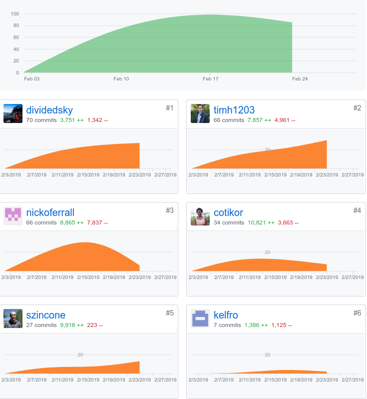
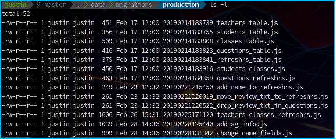
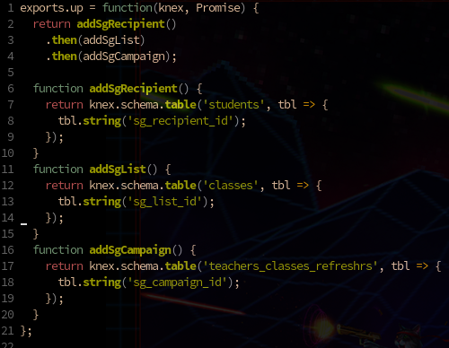
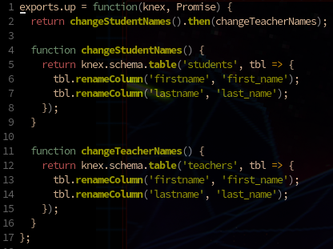

*My github handle: dividedsky*

# Part One: Individual Accomplishments
## Summary
Our third week in labs, we faced some challenges but made quite a bit of progress. While our think our site is quite where we would want in to be in terms of a UX/UI perspective, I'm confident that we've done enough work on the architecture of the site so that we're in a good place moving forward into next week.

This week, I mostly spent my time working on SendGrid with Tim, adding endpoints to the backend, and updating the schema as we realized there were some SendGrid things we would need to keep track of that we had not originally accounted for. I also worked on a couple simple layouts for pages: the class list, the refreshr list, the campaign section of the create class form, and the edit class form.

## Tasks Pulled
### Front End
* Refreshrs List
  * [github]('https://github.com/Lambda-School-Labs/labs10-student-follow/pull/76')
  * [trello]('https://trello.com/c/dijVSTQC/71-refreshr-list-layout')
* Class List
  * [github]('https://github.com/Lambda-School-Labs/labs10-student-follow/pull/84')
  * [trello]('https://trello.com/c/hQ4tDy6r/90-class-list-layout')
* Campaign (Refreshr) Form
  * [github]('https://github.com/Lambda-School-Labs/labs10-student-follow/pull/87')
  * [trello]('https://trello.com/c/LLn4GskP/63-front-end-with-sendgrid-flow')

### Back End
* Add teachers\_classes\_refreshrs table to database
  * [github]('https://github.com/Lambda-School-Labs/labs10-student-follow/pull/68')
  * [trello]('https://trello.com/c/zntnBbxL/79-update-schema-with-teachersclassesrefreshrs-table')

* Updating endpoints
  * [github]('https://github.com/Lambda-School-Labs/labs10-student-follow/pull/74')
  * [trello]()

* Adding columns to tables for SendGrid
  * [github]('https://github.com/Lambda-School-Labs/labs10-student-follow/pull/90')
  * [trello]('https://trello.com/c/aikFIWC5/91-add-sendgrid-columns-to-db')

## Detailed Analysis
One thing I've gotten more comfortable with this week is writing knex migrations. Knex migrations have always made me a little nervous. After countless corruptions of the migrations directory and other issues, I'm always a little bit scared to enter `knex migrate:latest` after writing new migrations.

So when doing complex updates to the database schema--for example, when needing to change several tables--I've always preferred to do it in several migrations of small steps--make a migration, update one table, make a new migration, update another table, etc. This quickly leads to a cluttered and complex migrations directory.

This week, as we got into the details of SendGrid and realized that we would need to keep track of a lot of different SendGrid variables--recipient id's for students, list id's for classes, campaign id's for refreshrs--I found myself having to update the database quite a few times.

In the past, if I had three tables to update, I probably would have done that in three separate migrations, then crossed my fingers three times as I ran those migrations. However, this week, as I updated all the tables, I found a much cleaner and (I think) preferable way to do it.

Since knex functions just return promises, it's fairly straightforward to write separate knex functions, and then chain them together. For example, yesterday I added columns for SendGrid to three separate tables. Instead of doing three separate migrations, I just wrote one migration with all the operations in it.

I write a function to add a column to the students table, another one to add a column to the classes tbale, and another to add a column to the refreshrs table. Then I simply chain those functions on lines 2 through 4.

Here's another one to update the column names on both the student and teachers table.

I'm sure this is common knowledge to a lot of people, but for me it was a nice discovery that has made my knex migrations cleaner, simpler, and easier to read.

# Part Two: Milestone Reflections

Working as a team to convert a disparate set of components into a cohesive product has been quite a challenge. Though we may still have a bit of work to do to get there, I think we made a lot of progress this week.

It's difficult to get a comprehensive idea of where the site is at when everyone is working on separate pieces of it. Some of us were working on Auth0, some of us were working on SendGrid, some of us were working on design. And we were all working, individually or in groups, on separate pages of the site.

This makes it hard to get an overview of the site as a whole. Furthermore, if I'm working on one component and get it working, it may break when it's integrated with someone else's component. Or my component may break their's.

We've certainly faced some challenges in this regard, and perhaps we're a little bit behind where we'd like to be. But I feel confident in the overall progress of our project, and I'm looking forward to making it shine next week.
